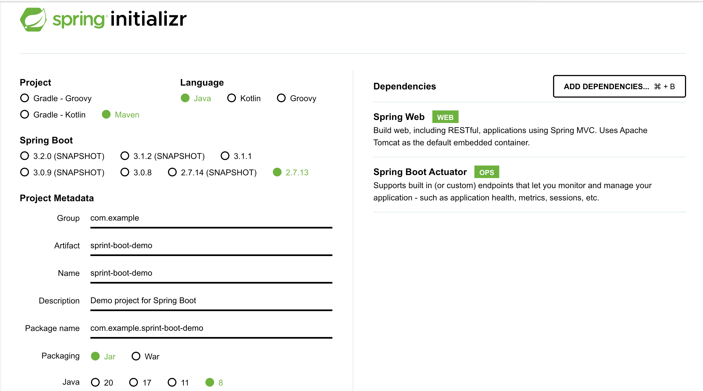
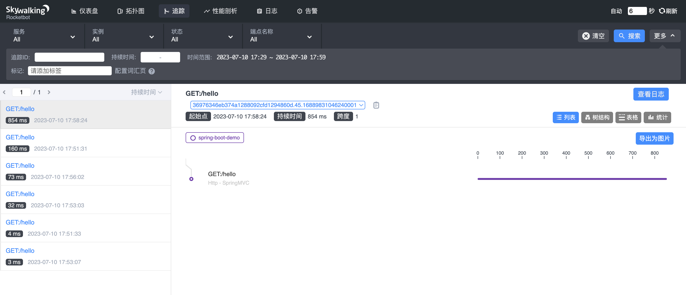
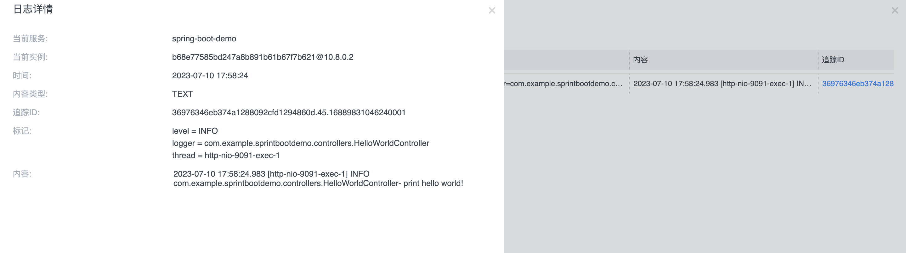

- [init](#init)
- [health and metrics](#health-and-metrics)
	- [health](#health)
	- [metrics](#metrics)
		- [增加micrometer依赖](#增加micrometer依赖)
		- [application.properties](#applicationproperties)
- [build](#build)
- [run](#run)
- [test](#test)
- [skywalking](#skywalking)
- [reference](#reference)

## init  

使用<https://start.spring.io/> 生成demo。


## health and metrics

### health 

pom 文件增加

```xml
  <dependency>
   <groupId>org.springframework.boot</groupId>
   <artifactId>spring-boot-starter-actuator</artifactId>
  </dependency>
```

### metrics

#### 增加micrometer依赖

```xml
  <dependency>
   <groupId>io.micrometer</groupId>
   <artifactId>micrometer-registry-prometheus</artifactId>
   <version>1.9.0</version>
  </dependency>
```

#### application.properties

```properties
server.port=9091
management.endpoints.enabled-by-default=true  # 启用所有管理端点，默认情况下所有的管理端点都是开启的。
management.endpoints.web.exposure.include=*  # 暴露所有web端点 
management.metrics.tags.application=spring-boot-demo # tag
```

## build

```bash
mvn clean package -Dmaven.test.skip=true
```

## run

```bash
java -jar target/sprint-boot-demo-0.0.1-SNAPSHOT.jar

# skywalking
java -javaagent:`pwd`/skywalking-agent/skywalking-agent.jar  -Dskywalking.agent.service_name=spring-boot-demo -Dskywalking.collector.backend_service=127.0.0.1:11800 -jar target/sprint-boot-demo-0.0.1-SNAPSHOT.jar
```

## test

```bash
# prometheus
http://localhost:9091/actuator/prometheus

# health
http://localhost:9091/actuator/health

# hello
http://localhost:9091/hello
```

## skywalking

```bash
# 引入jar包 
        <dependency>
            <groupId>org.apache.skywalking</groupId>
            <artifactId>apm-toolkit-logback-1.x</artifactId>
            <version>8.6.0</version>
        </dependency>

# 配置logback.xml 文件
见配置文件

# 启动
java -javaagent:`pwd`/skywalking-agent/skywalking-agent.jar  -Dskywalking.agent.service_name=spring-boot-demo -Dskywalking.collector.backend_service=127.0.0.1:11800 -jar target/sprint-boot-demo-0.0.1-SNAPSHOT.jar
```

链路



相关日志



## reference

[Springboot 集成 micrometer（actuator/prometheus） 报 404](https://blog.csdn.net/linzhiji/article/details/112425193)

[Spring-Boot-2.7-Release-Notes](https://github.com/spring-projects/spring-boot/wiki/Spring-Boot-2.7-Release-Notes)

[Springboot接入SkyWalking分布式链路追踪](https://juejin.cn/post/6981640309943828487)

