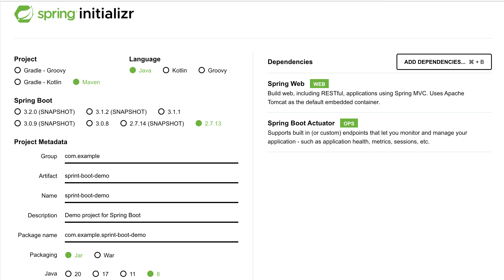

## init 

使用https://start.spring.io/ 生成demo。


## 增加micrometer依赖
```xml
		<dependency>
			<groupId>io.micrometer</groupId>
			<artifactId>micrometer-registry-prometheus</artifactId>
			<version>1.9.0</version>
		</dependency>
```

## application.properties
```properties
server.port=9091
management.endpoints.enabled-by-default=true  # 启用所有管理端点，默认情况下所有的管理端点都是开启的。
management.endpoints.web.exposure.include=*  # 暴露所有web端点 
management.metrics.tags.application=spring-boot-demo # tag
```

## build 
```bash
mvn clean package -Dmaven.test.skip=true
```

## test
```bash
# prometheus
http://localhost:9091/actuator/prometheus

# health
http://localhost:9091/actuator/health
```


## reference

[Springboot 集成 micrometer（actuator/prometheus） 报 404](https://blog.csdn.net/linzhiji/article/details/112425193)